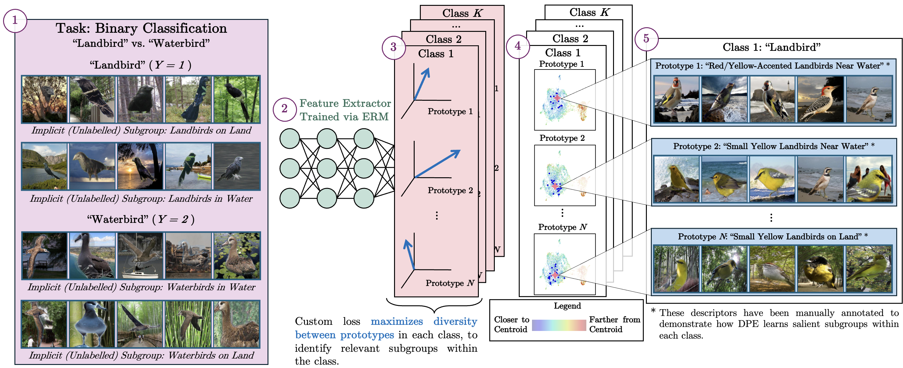

# <u>D</u>iverse <u>P</u>rototypical <u>E</u>nsembles Improve Robustness to Subpopulation Shift



---

Overview
========

This repository contains the official implementation and experiments for our ICML 2025 paper:  
**Diverse Prototypical Ensembles Improve Robustness to Subpopulation Shift**  
Project summary site: https://minhto2802.github.io/diversified_prototypical_ensemble

We propose a simple and scalable approach for improving model robustness under subpopulation shift, without relying on
explicit group annotations. The method builds on the intuition that diverse classifiers trained on different parts of
the data distribution can complement one another, especially when subgroup annotation is available for training.

Our approach combines a pretrained backbone with a *diversified ensemble of prototype-based classifiers*, each trained
on a different balanced subset of data. Diversity among ensemble members is further encouraged via an inter-prototype
similarity loss, resulting in broader coverage and better generalization to underrepresented subgroups.
We evaluate DPE on 9 real-world datasets, covering four types of subpopulation shift scenarios: *Spurious Correlations*,
*Attribute Imbalance*, *Class Imbalance*, and *Attribute Generalization*.

The training pipeline includes:

- **Stage-0**: Supervised backbone pretraining using ERM loss.
- **Stage-1+**: Training multiple prototype classifiers on resampled subsets to form an ensemble.

> This framework is designed to be flexible and applicable in both with and without subgroup annotation scenarios.


---

Notebooks
===

We provide a collection of Jupyter notebooks under the [`notebooks/`](notebooks/) directory to illustrate key components
of Diverse Prototypical Ensembles (DPE) through visualization, controlled experiments, and ablation studies. These
notebooks provide a walkthrough of the motivation and implementation of our method as described in the paper,
demonstrated on two standard benchmark datasets.

- **[`00_synthetic.ipynb`](notebooks/00_synthetic.ipynb)**  
  A 2D synthetic experiment that simulates subpopulation shift under controlled conditions.  
  This notebook visualizes the limitations of standard classifiers trained on imbalanced subgroups and demonstrates how
  DPE achieves better coverage and robustness through diversified prototype ensembles.

- **[`01_waterbirds_with_attribute_annotation.ipynb`](notebooks/01_waterbirds_with_attribute_annotation.ipynb)**  
  Full pipeline demonstration of DPE on the Waterbirds dataset, using group-annotated validation data.  
  This notebook highlights the effectiveness of training diverse classifiers on balanced group subsets, and evaluates
  per-group accuracy improvements over the ERM baseline.

- **[`02_celeba_without_attribute_annotation.ipynb`](notebooks/02_celeba_without_attribute_annotation.ipynb)**  
  Application of DPE to the CelebA dataset in a more realistic setting where subgroup labels are not available.  
  It shows that even without group supervision, DPE outperforms strong baselines such as Deep Feature Reweighting (DFR)
  in worst-group accuracy. The notebook also illustrates that increasing the number of DFR heads does not further
  improve fairness, while DPE consistently improves both robustness and subgroup equity.

> Each notebook is self-contained and can be executed independently. These examples serve as a foundation for adapting
> DPE to other datasets and deployment scenarios.

---

Reproducing the Paper Results
=============================

This section provides the steps and configuration details needed to reproduce the experiments from our ICML 2025 paper.

## Data Preparation

We follow the dataset setup instructions from [SubpopBench](https://github.com/YyzHarry/SubpopBench), which provides
scripts and guidelines for preparing all datasets used in our experiments (e.g., Waterbirds, CelebA, MetaShift,
MultiNLI).

To prepare the data:

1. Follow the instructions in the SubpopBench repository to download and preprocess each dataset.
2. Make sure the processed datasets are stored under a common root directory (e.g., `/datasets`).
3. Set `--data_dir` to this root directory when running the training scripts.

## Quickstart

### Stage-0 Training (ERM)

To fine-tune an ImageNet-pretrained ResNet-50 on the MetaShift dataset (located at `/datasets/metashift`), run:

```
python main.py \
  --epochs 100 \
  --loss_name ce \
  --dataset_name MetaShift \
  --pretrained_imgnet \
  --ckpt_dir /checkpoint/ \
  --data_dir /datasets
```

### Stage-1+ Training (Diversified Prototypes)

Once Stage-0 is complete, initiate prototype ensemble training using the pretrained backbone:

```
python main.py \
  --dataset_name MetaShift \
  --pretrained_path /checkpoint/ckpt_last.pt \
  --ckpt_dir /checkpoint \
  --loss_name isomax \
  --stage 1 \
  --num_stages 16 \
  --epochs 20 \
  --cov_reg 1.e5 \
  --batch-size 64 \
  --optim sgd \
  --lr 1.e-3 \
  --train_attr yes \
  --train_mode freeze \
  --subsample_type group \
  --ensemble_criterion wga_val \
  --entropic_scale 20 \
  -ncbt \
  -sit \
```

### Launch All Predefined Jobs

To run all supported configurations for available datasets:

```
sbatch scripts/train_all.sh
sbatch scripts/train_all_pe.sh
```

## Key Arguments

### General

- `--dataset_name`: e.g., Waterbirds, CelebA, MultiNLI, MetaShift
- `--model_name`: e.g., resnet50, bert-base-uncased
- `--epochs`, `--lr`: controls training length and learning rate
- `--seed`: sets random seed for reproducibility

### Stage-0

- `--loss_name`: `ce` (default)
- `--train_mode`: `full` (default) or `freeze`

### Stage-1+

- `--stage 1`
- `--pretrained_path`: path to Stage-0 model checkpoint
- `--num_stages`: number of ensemble heads (default: 16)
- `--cov_reg`: strength of inter-prototype similarity penalty
- `--subsample_type`: None or `group` (subgroup-balanced subsampling if `--train_attr yes` or class-balanced subsampling if `--train_attr no`)
- `--entropic_scale`: IsoMax temperature scaling factor
- `--train_mode freeze`: freeze backbone, train only prototypes
- `-ncbt`: disables class-balanced batch construction
- `-sit`: enables data shuffling at each epoch
- `--ensemble_criterion`: ensemble member selection criterion (e.g. `val_wga`: based on the best worst group accuracy on
  the validation set)

## Training Tips

- **Metric Logging**: W&B logs all ensemble-level metrics under the `ensemble_` prefix, such as
  `ensemble_worst_group_acc`.
- **Covariance Regularization**: Tune `--cov_reg` between 1e4 and 1e6 to control prototype diversity.
- **IsoMax Temperature**: Use `--entropic_scale` between 10 and 40 depending on dataset.
- **Balanced Sampling**:
    - `--subsample_type group` ensures subgroup-balanced training when `--train_attr yes`.
    - `--subsample_type class` enables class-balanced sampling when `--train_attr no`.
- **Training Schedule**:
    - Stage-1+ typically converges within 15–30 epochs.
- **Output Directory Layout**:
    - Checkpoints: `/checkpoint/$USER/$SLURM_JOB_ID/ckpt_*.pt`
    - Logs: `logs/<jobname>.<id>.log`
- **Disabling W&B**: Use `--no_wandb` to turn off logging for debugging.

## Expected Outputs

### Stage-0

- Model checkpoints:  
  `ckpt_best_acc.pt`, `ckpt_best_bal_acc.pt`, `ckpt_last.pt`
- Optional feature dumps:  
  `feats_val.npy`, `feats_test.npy`

### Stage-1+

- Prototype ensembles:  
  `prototype_ensemble_<criterion>.pt`
- Distance scale parameters:  
  `dist_scales_<criterion>.pt`
- Precomputed embeddings:  
  Auto-saved to the directory specified by `--ckpt_dir`
- Logs and visualizations (if W&B is enabled)

> These instructions match the setup used to produce results in our ICML 2025 paper. For additional visual analysis and
ablation studies, refer to the [Notebooks](#notebooks) section.


---

# Results

Worst-group accuracy on datasets **without subgroup annotations**:

| Algorithm         | Waterbirds | CelebA   | CivilComments | MultiNLI | MetaShift | CheXpert | ImageNetBG | NICO++   | Living17 |
|-------------------|------------|----------|---------------|----------|-----------|----------|------------|----------|----------|
| ERM*              | 77.9±3.0   | 66.5±2.6 | 69.4±1.2      | 66.5±0.7 | 80.0±0.0  | 75.6±0.4 | 86.4±0.8   | 33.3±0.0 | 53.3±0.9 |
| ERM* + DPE (Ours) | 94.1±0.2   | 84.6±0.8 | 68.9±0.6      | 70.9±0.8 | 83.6±0.9  | 76.8±0.1 | 88.1±0.7   | 50.0±0.0 | 63.0±1.7 |

Worst-group accuracy on datasets **with subgroup annotation**:

| Algorithm         | Group Info<br>(Train / Val) | WATERBIRDS | CELEBA   | CIVILCOMMENTS | MULTINLI | METASHIFT | CHEXPERT |
|-------------------|-----------------------------|------------|----------|---------------|----------|-----------|----------|
| ERM*              | X / X                       | 77.9±3.0   | 66.5±2.6 | 69.4±1.2      | 66.5±0.7 | 80.0±0.0  | 75.6±0.4 |
| ERM* + DPE (ours) | X / ✓✓                      | 94.1±0.4   | 90.3±0.7 | 70.8±0.8      | 75.3±0.5 | 91.7±1.3  | 76.0±0.3 |

✗: no group info is required  
✓: group info is required for hyperparameter tuning  
✓✓: validation data is required for training and hyperparameter tuning

More tables and detailed experimental breakdowns are available at:  
https://github.com/anonymous102030411/anon

---

Citation
--------

```
@inproceedings{to2025dpe,
  title     = {Diverse Prototypical Ensembles Improve Robustness to Subpopulation Shift},
  author    = {Nguyen Nhat Minh To and Paul F. R. Wilson and Viet Nguyen and Mohamed Harmanani and Michael Cooper and Fahimeh Fooladgar and Purang Abolmaesumi and Parvin Mousavi and Rahul Krishnan},
  booktitle = {International Conference on Machine Learning (ICML)},
  year      = {2025}
}
```

Acknowledgements
----------------

Much of the training and evaluation infrastructure in this repository was adapted
from: https://github.com/YyzHarry/SubpopBench  
IsoMax loss function implementation was provided by https://github.com/dlmacedo/entropic-out-of-distribution-detection

We thank the authors for releasing their well-organized benchmark and codebase.
