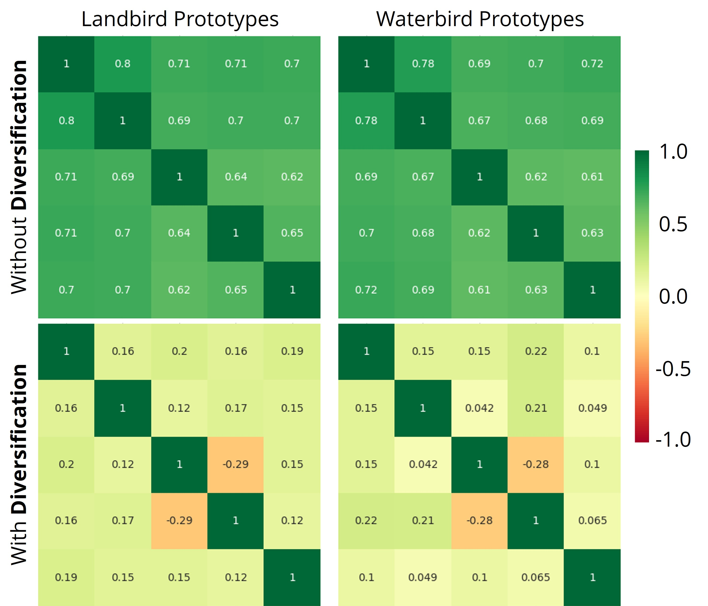
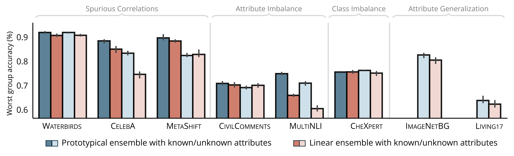

# Visualizations

## Ensemble Prototype Diversity

We visualize the cosine similarity matrices between learned prototypes for the `Waterbird` and `Landbird` classes. Lower off-diagonal values confirm that the Inter-Prototype Similarity (IPS) loss promotes meaningful diversity among prototypes, enabling DPE to capture distinct subpopulation modes.

---

## Ablation Study: Diversification Strategies

We compare three diversification strategies to assess their impact on worst-group accuracy:

- **Fixed Subsets**: Each prototype is trained on the same validation subset (baseline).
- **Random Subsets**: Each prototype is trained on a randomly sampled subset.
- **Random Subsets + IPS**: Our proposed method, combining random sampling with the IPS loss.

Our proposed strategy consistently yields the highest WGA across all datasets.

---

## Linear vs. Prototypical Ensemble

We compare DPE against a linear ensemble baseline across multiple subpopulation shift benchmarks. DPE significantly outperforms the linear ensemble in both attribute imbalance (e.g., MULTINLI) and attribute generalization (e.g., IMAGENETBG, LIVING17).

